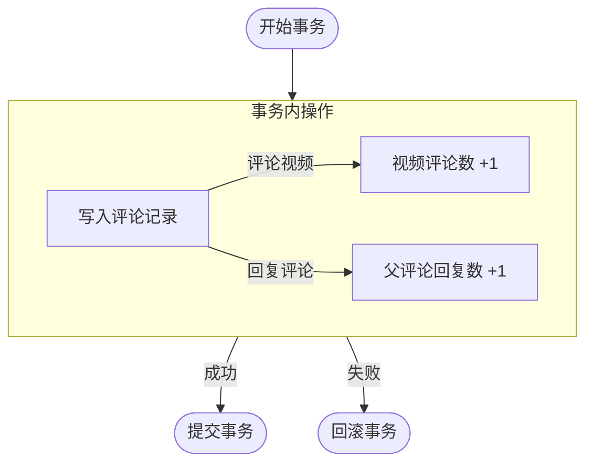
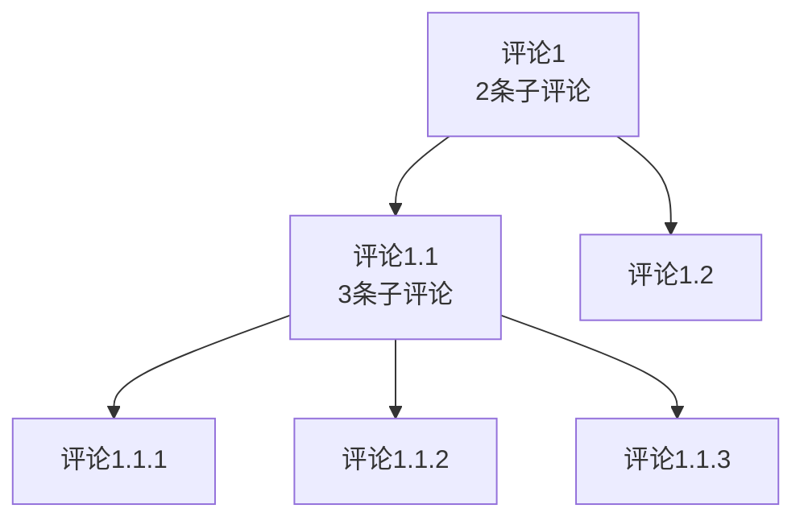

# 设计文档

## 评论

### 模型结构

```go
type Comment struct {
// 评论ID
ID           int64
// 用户ID
UserID       int64
// 视频ID
VideoID      int64
// 父评论ID
ParentID     *int64
// 评论内容
Content      string
// 点赞数
LikeCount    int64
// 评论数
CommentCount int64
// 创建时间
CreatedAt    time.Time
}
```

### LikeCount、CommentCount

`LikeCount`、`CommentCount`是冗余字段，在评论、点赞增删时在同一个事务中同步增删，避免使用子查询，以提高查询性能



### 评论计数

目前设计是只包含下一级评论的评论数



参考某B开头视频软件应该得把所有枝干的子评论数都算上，但是因为现在评论是树状的，感觉实现起来有点抽象，后续考虑改成两级评论

## 聊天

### 

