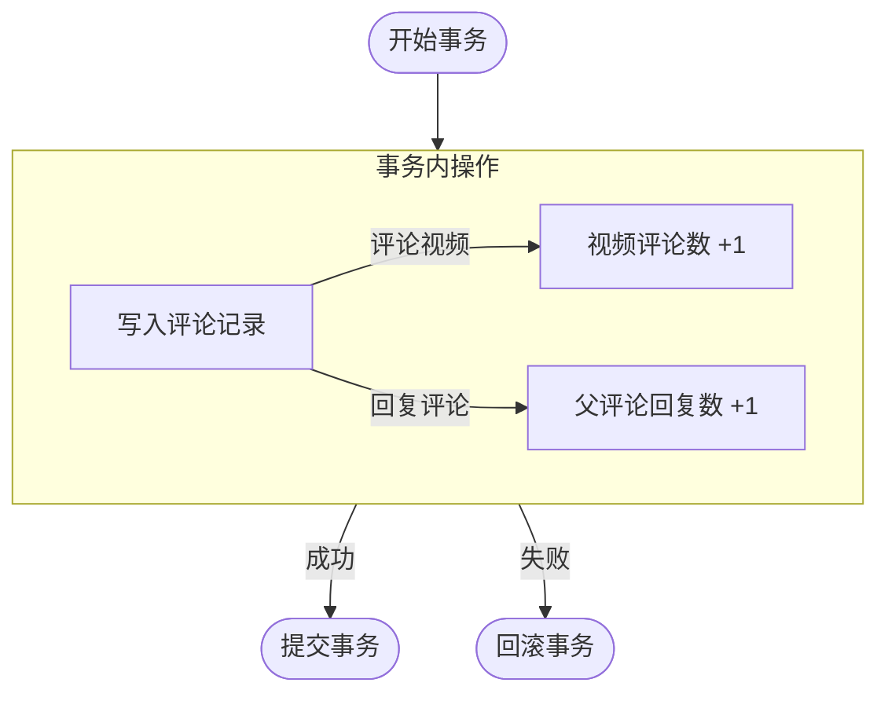
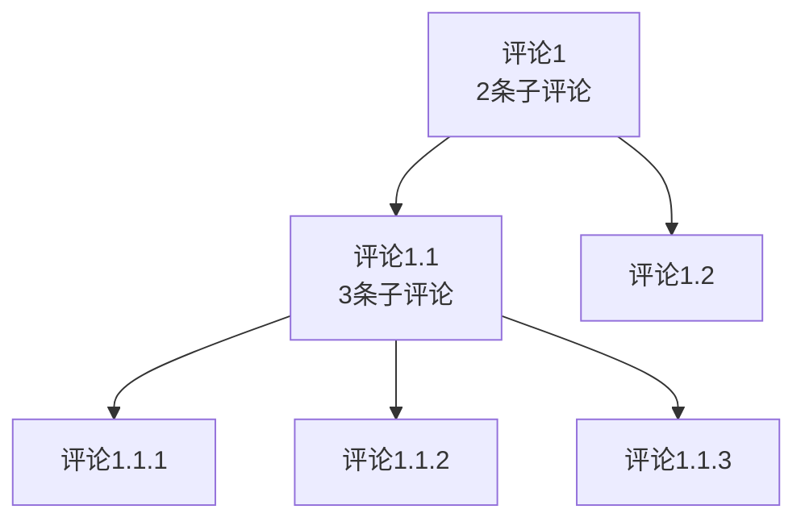
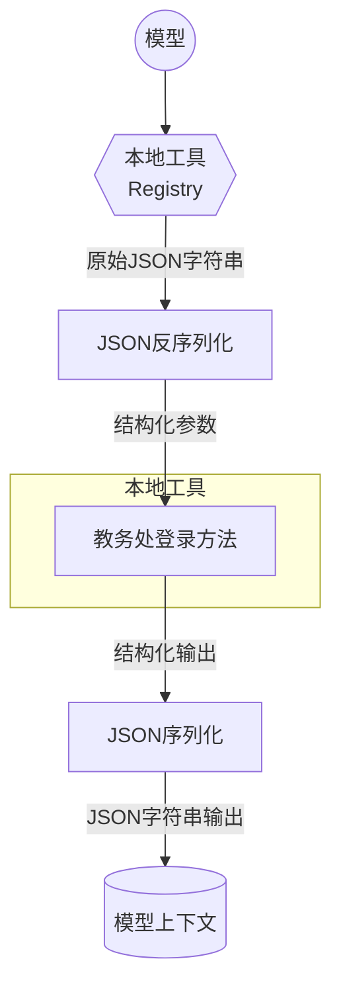
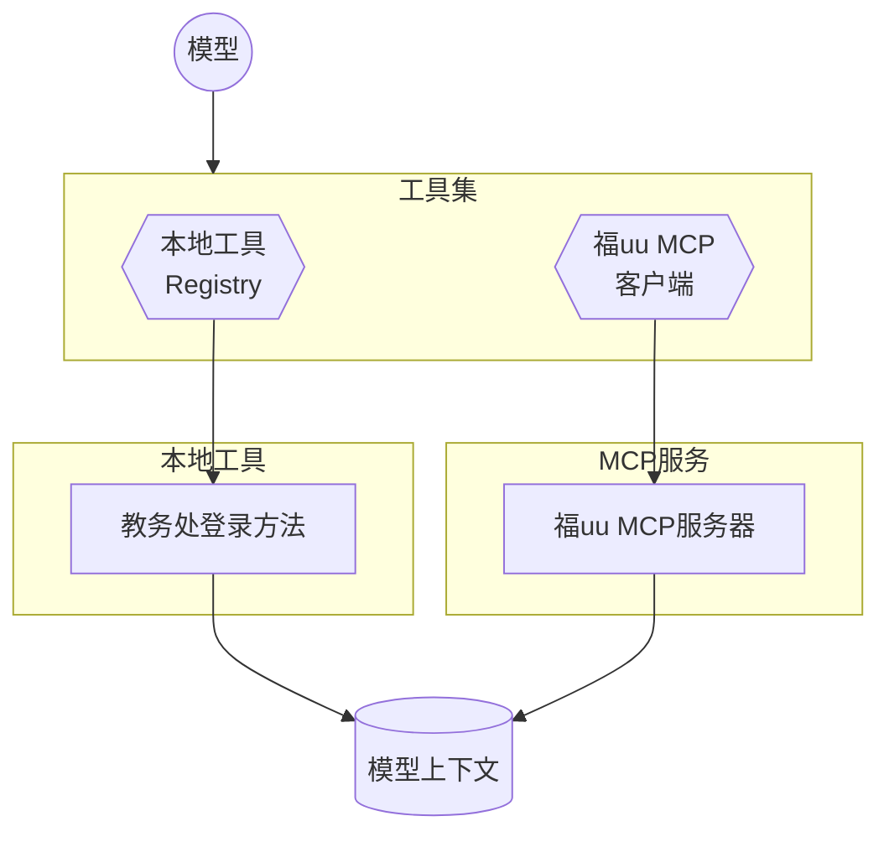
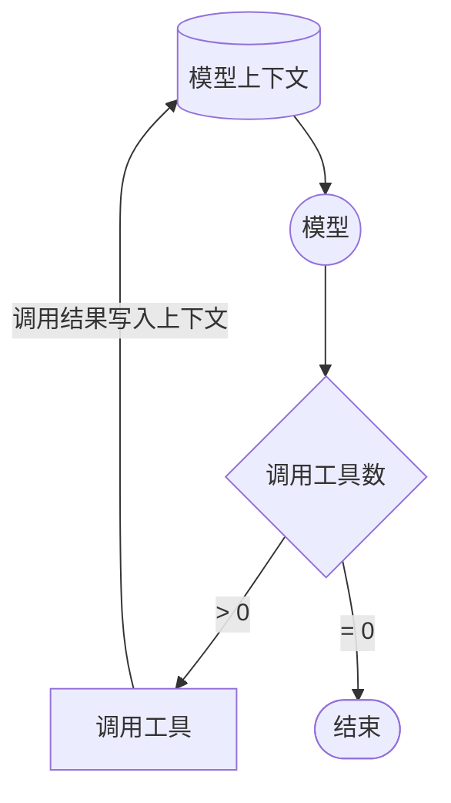
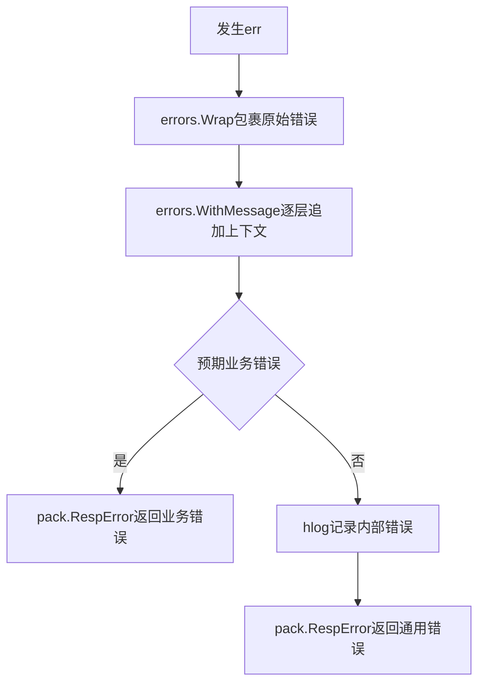

# 设计文档

## 评论

### 模型结构

```go
type Comment struct {
    // 评论ID
    ID           int64
    // 用户ID
    UserID       int64
    // 视频ID
    VideoID      int64
    // 父评论ID
    ParentID     *int64
    // 评论内容
    Content      string
    // 点赞数
    LikeCount    int64
    // 评论数
    CommentCount int64
    // 创建时间
    CreatedAt    time.Time
}
```

### LikeCount、CommentCount

`LikeCount`、`CommentCount`是冗余字段，在评论、点赞增删时在同一个事务中同步增删，避免使用子查询，以提高查询性能



### 评论计数

只包含下一级评论的评论数



参考某B开头视频软件应该得把所有枝干的子评论数都算上，但是因为现在评论是树状的，感觉实现起来有点抽象，后续考虑改成两级评论

## AI聊天

目前是在私聊的基础上写的

### 工具

#### MCP

每次拉起会话会直接新建一个MCP客户端，然后从福uu的MCP服务器获取工具列表并将工具塞进上下文里

#### 本地Tool

本地Tool只有一个教务处的，然后做了亿点点封装。把教务处登录的函数输入和输出封装成结构体，注册到本地工具里，LLM初始化对话的时候塞进上下文，需要调用的时候优先从本地Tool找工具



#### 调用流程



### Agent循环

好像没什么好说的，其实就是个for循环，每轮循环检查调用工具数是否为0，不为0就调用工具，然后进行下一轮循环，知道不再需要调用工具，那最后一个回答就是最终结果



### 安全机制

通过工具的`Authorize`方法传入`ToolCallContext`来限制模型只能访问私聊两个人的教务处账号

## 错误处理

参考[Go 项目分层下的最佳 error 处理方式](https://juejin.cn/post/7246777406387306553)的错误处理方式，使用`errors.Wrap`包裹`err`，然后逐层包裹`errors.WithMessage`，最后在`pack.RespError`中将非预期的内部错误通过hlog处理

