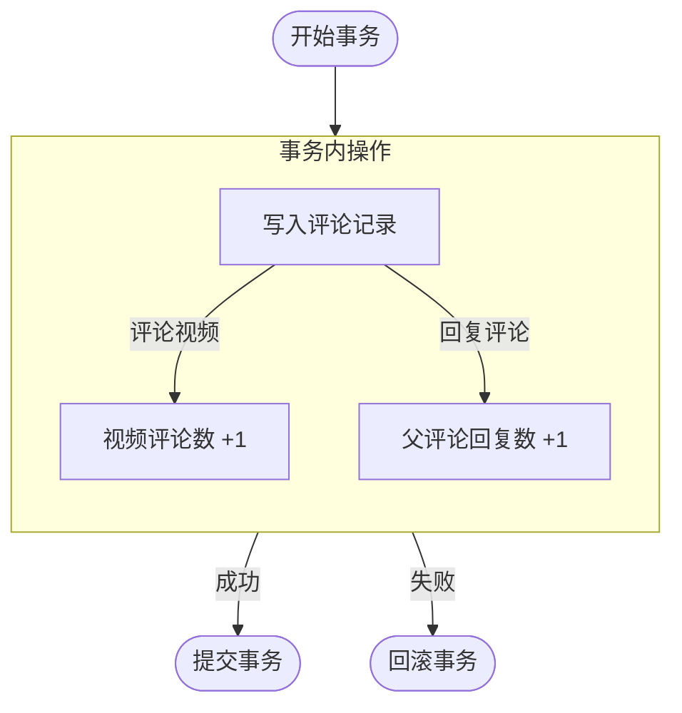
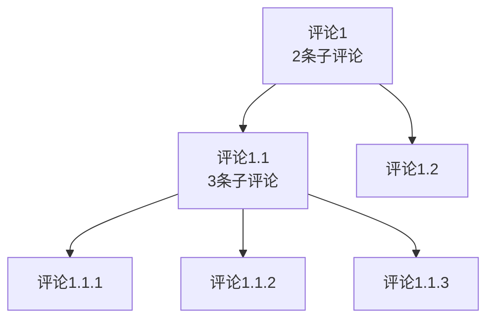
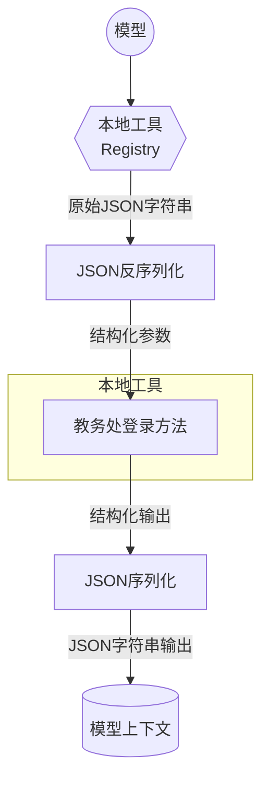
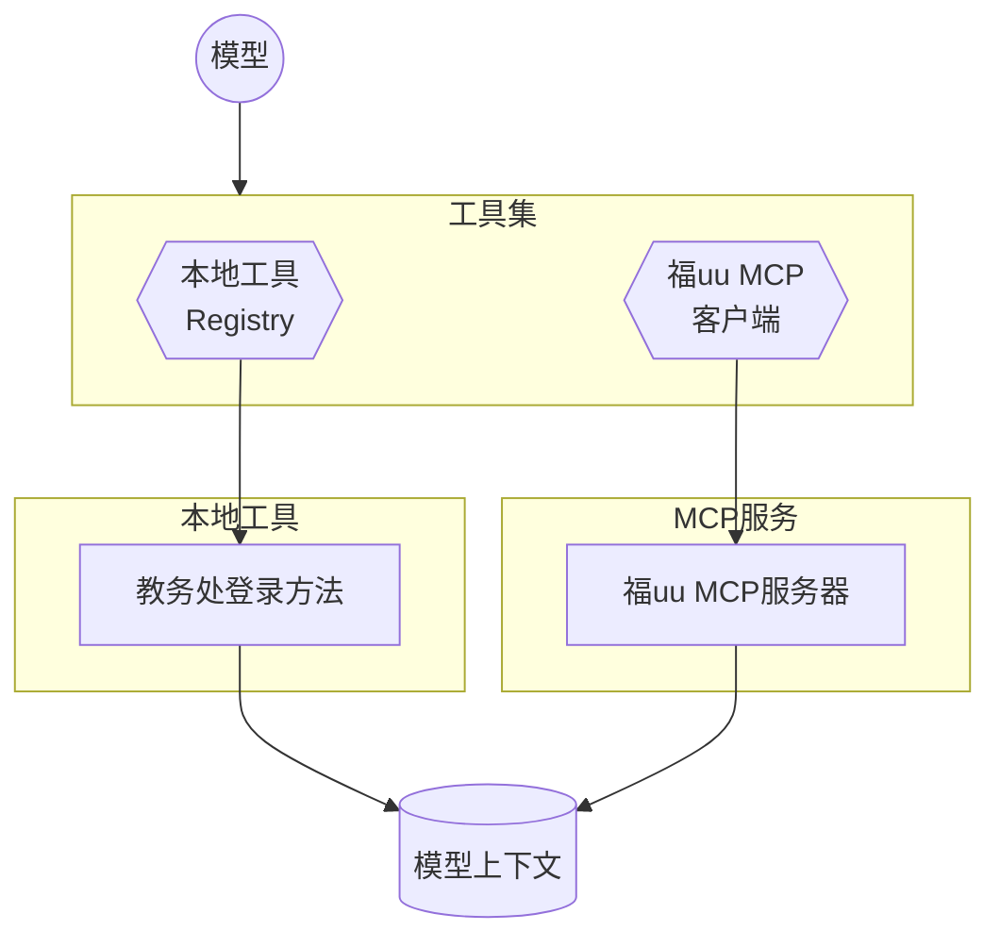
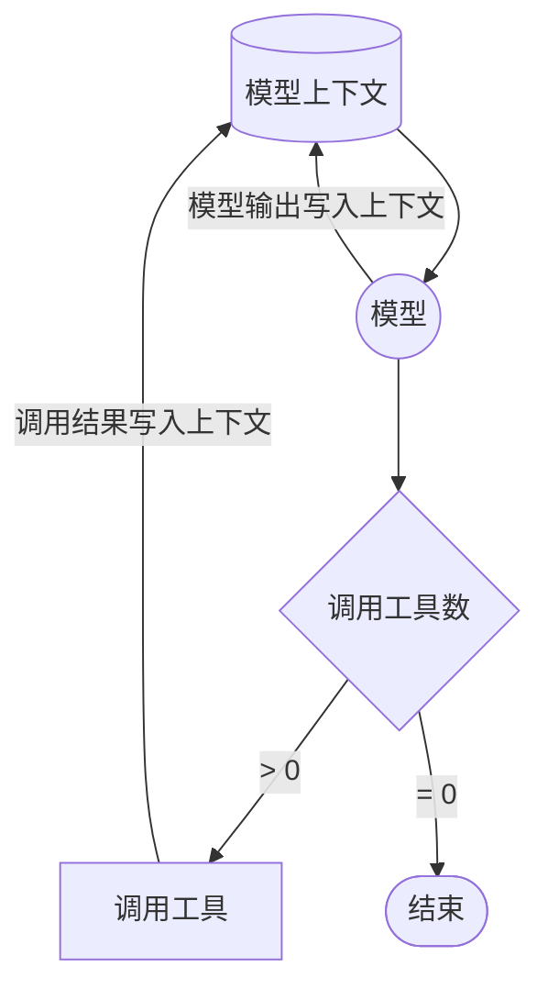
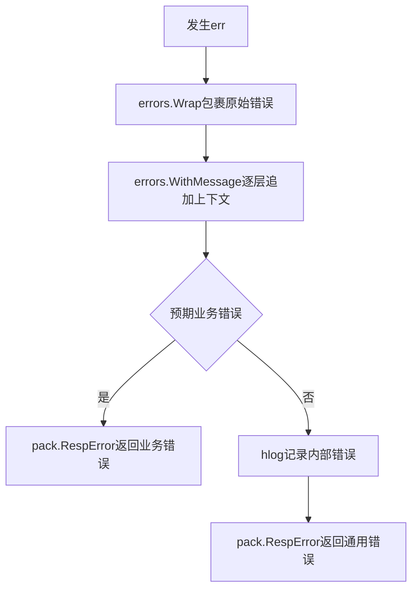
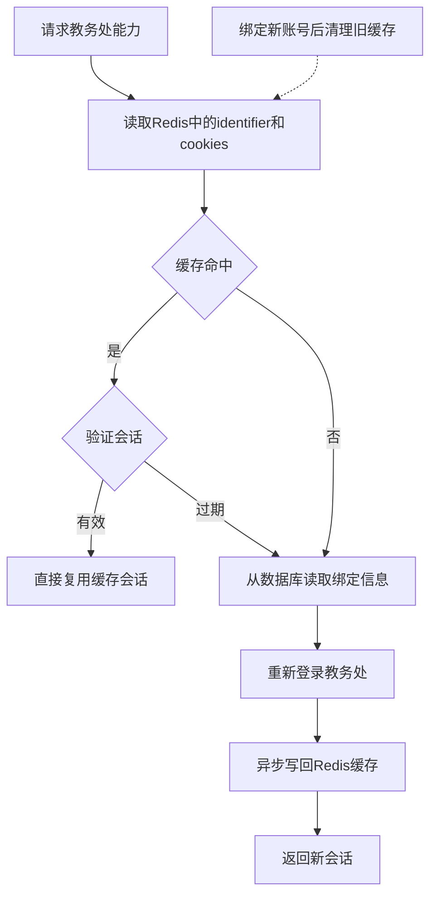
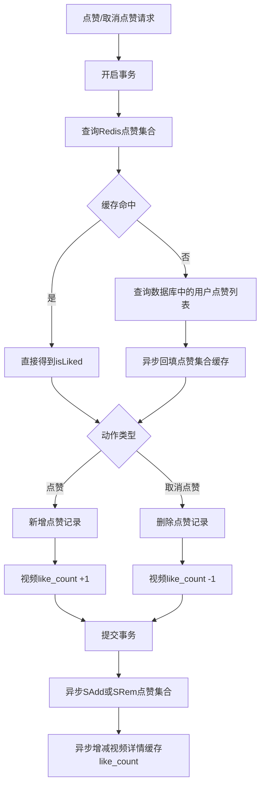
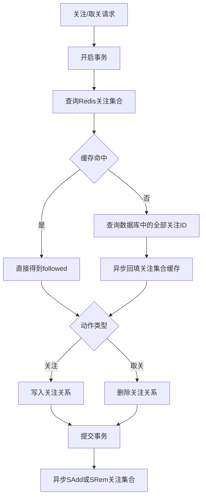
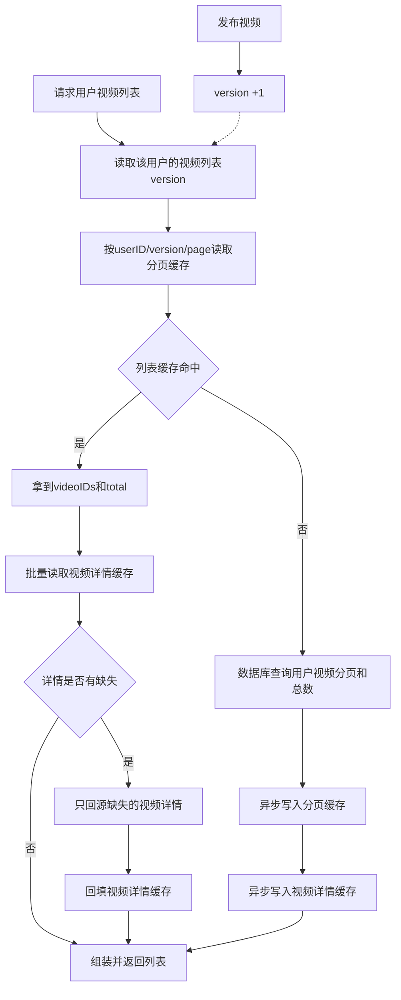

# 报告

## 项目结构

```
tiktok-go/
├── cmd/
│   ├── api/                       # APP入口点
│   ├── chat/                      # 聊天客户端 (100 %AI)
│   └── gorm-gen/                  # GORM Gen
│
├── config/                        # 配置模块
├── idl/                           # 接口定义
├── biz/                           # 业务逻辑层
│   ├── handler/                   # HTTP处理器
│   ├── service/                   # 业务服务层
│   │   ├── user/                  # 用户
│   │   ├── video/                 # 视频
│   │   ├── interaction/           # 互动
│   │   ├── social/                # 社交
│   │   └── chat/                  # 聊天
│   │
│   ├── router/                    # 路由
│   ├── model/                     # 请求和响应数据模型
│   ├── pack/                      # 响应数据打包方法
│   └── mw/                        # 中间件
│       ├── log/                   # 日志中间件
│       ├── sentinel/              # Sentinel中间件
│       └── auth/                  # JWT认证中间件
│   
└── pkg/                           # 通用工具包
    ├── db/                        # 数据库访问
    │   ├── postgres.go            # 数据库连接初始化
    │   ├── model/                 # 数据库模型
    │   ├── query/                 # Gen查询
    │   └── ...
    │
    ├── cache/                     # 缓存
    │   ├── redis.go               # Redis连接初始化
    │   └── ...
    │
    ├── bucket/                    # 对象存储
    │   ├── minio.go               # MinIO客户端初始化
    │   └── ...
    │
    ├── ai/                        # AI聊天
    ├── jwt/                       # JWT工具包
    ├── crypt/                     # 对称加密
    ├── ffmpeg/                    # 媒体处理
    ├── img/                       # 图片处理
    ├── errno/                     # 错误码定义
    ├── constants/                 # 全局常量
    ├── totp/                      # TOTP多因素认证
    └── utils/                     # 工具函数          
```

## 上次Review

### 冗余字段

在需要统计评论数和点赞数的表对象中加入`like_count`、`comment_count`冗余字段，提高查询性能，避免用子查询或者`Left Join`来计算评论数和点赞数

> 避免子查询N+1，而且Gen不好实现子查询 (*麻烦)

```sql
comments
(
id            BIGINT GENERATED ALWAYS AS IDENTITY PRIMARY KEY,
user_id       BIGINT      NOT NULL,
video_id      BIGINT      NOT NULL,
parent_id     BIGINT,
content       TEXT        NOT NULL,
like_count    BIGINT      NOT NULL DEFAULT 0,
comment_count BIGINT      NOT NULL DEFAULT 0,
created_at    TIMESTAMPTZ NOT NULL DEFAULT CURRENT_TIMESTAMP,
```

### 事务

在需要多次SQL操作的服务里使用事务，保证数据一致性
```go
err = db.DB.Transaction(func(tx *gorm.DB) error {
comment, err := s.commentDao.WithTx(tx).GetCommentByID(s.ctx, commentID)
...
}
```



### 约束

给所有表加检查约束和外键约束，防止脏数据意外落库

```sql
likes
(
    ...

    CONSTRAINT fk_likes_user_id FOREIGN KEY (user_id) REFERENCES users (id) ON DELETE RESTRICT,
    CONSTRAINT fk_likes_video_id FOREIGN KEY (video_id) REFERENCES videos (id) ON DELETE RESTRICT,
    CONSTRAINT fk_likes_comment_id FOREIGN KEY (comment_id) REFERENCES comments (id) ON DELETE CASCADE,
    CONSTRAINT chk_likes_target_exactly_one CHECK (
        (video_id IS NOT NULL AND comment_id IS NULL)
            OR
        (video_id IS NULL AND comment_id IS NOT NULL)
        )
);
```

### 错误传递
见下文[错误处理](#错误处理)

## 接口

### 聊天

#### 请求
使用`adaptor.HertzHandler`自定义一个`ChatHandler`，在校验请求头携带的`access_token`后将HTTP请求升级为Websocket连接

#### 连接管理

使用`OnlineUserManager`来管理在线用户，内部通过 `map[int64]OnlineUser`维护用户ID与WebSocket连接的映射关系，使用`sync.RWMutex`来保证操作原子性

#### 消息结构

将传输数据统一封装为`Message`结构，包含`type`和`body`两部分。`Message`再派生出不同的消息类型

- `ChatMessage`: 普通聊天消息
- `HistoryRequest / HistoryMessage`: 历史消息拉取与返回
- `UnreadRequest / UnreadMessage`: 未读消息拉取与返回
- `ErrorMessage`: 错误消息

#### 聊天处理

对于在线用户直接从Websocket发送消息，然后将消息标记已读时间并入库，离线则将已读时间标记为`null`并入库

### 评论

树状评论，不是很好计数，后续可以考虑改为类似B站的二级评论结构，回复二级评论变成`@xxx(特殊占位符) 评论内容`，目前评论计数只包含下一级评论的评论数




### MFA

接口在上一次作业中完成，本次做了安全性改进。使用`AES GCM`加密`totp_secret`后存入数据库，使用时再解密，提高安全性

### 教务处绑定

使用jwch库校验传入的学号和密码，并且使用`AES GCM`加密`jwch_password`后存入数据库

## AI聊天

目前基于私聊实现

### 工具

#### MCP

每次拉起会话会直接新建一个MCP客户端，然后从福uu的MCP服务器获取工具列表并将工具塞进上下文里。

> 考虑到福uu的MCP使用了CDN，无法长时间连接需要重连机制，而且保持连接有点浪费资源。

#### 本地Tool

本地Tool只有一个教务处的，然后做了亿点点封装。把教务处登录的函数输入和输出封装成结构体，注册到本地工具里，LLM初始化对话的时候塞进上下文，需要调用的时候优先从本地Tool找工具



#### 调用流程



### Agent循环

好像没什么好说的，其实就是个for循环，每轮检查工具调用数，不为0则调用工具并继续，为0则结束，以最后一个回答为最终结果



### 安全机制

通过工具的`Authorize`方法传入`ToolCallContext`来限制模型只能访问私聊两个人的教务处账号

### 聊天处理

每当用户发送消息时，AI会自己判断是否需要回复， AI的聊天会以消息字段`is_ai: true`入库，会有两条`receiver_id`和`sender_id`相反的记录，方便未读消息拉取 (然后历史消息变难写了，难绷)

## 项目管理

### 源代码管理
PR + 窝瓜合并 (Squash)

- 优点: 线性历史，没有很杂的提交记录
- 缺点: PR稍微大点一个commit就成百上千行

### 项目配置

- .dockerignore: Docker构建忽略配置
- .editorconfig: 代码风格配置
- .gitignore: Git忽略文件追踪配置
- .gitattributes: Git文件配置
- .golangci.yml: 静态代码分析配置
- codecov.yml: Codecov Bot配置文件，覆盖率检查
- renovate.json: Renovate Bot配置文件，自动PR依赖更新

### 工作流

- ci: 二进制编译 (Windows + Linux矩阵)
- ci-docker: Docker镜像打包
- codeql: 漏洞扫描
- lint: 代码规范
- test: 单元测试和测试覆盖
- release: 发版相关

## 细节优化

### 错误处理

参考[Go 项目分层下的最佳 error 处理方式](https://juejin.cn/post/7246777406387306553)的错误处理方式，使用`errors.Wrap`包裹`err`，然后逐层包裹`errors.WithMessage`，最后在`pack.RespError`中将非预期的内部错误通过hlog处理


### 参数校验

在idl中使用`api.vd`参数定义，表达式是字节跳动的[go-tagexpr](https://github.com/bytedance/go-tagexpr/tree/master) (已经似了)，其实在`handler`和`service`已经校验了绝大部分参数，这里象征性写几个分页校验

```thrift
// 发布列表请求
struct ListReq {
    // 用户ID
    1: required string user_id (api.query = 'user_id');
    // 页码
    2: required i32 page_num (api.query = 'page_num', api.vd="$ >= 0");
    // 单页尺寸
    3: required i32 page_size (api.query = 'page_size', api.vd="$ >= 1 && $ <= 100");
}
```

### 流量治理

使用`Sentinel`中间件对API进行限流，`Sentinel`中间件放入mw模块统一进行初始化

### 代码复用

大部分可复用的代码都在pkg里

本轮将`service`层大量的分页fallback移动到了`pkg/utils/page`中`NormalizePage`方法里

## 单元测试

### 子测试
使用子测试进行多样例测试
```go
func TestXXX(t *testing.T) {
	type testCase struct {
		parm xxx
		wantResult     xxx
	}

	testCases := map[string]testCase{
		"xxx": ...,
		"xxx": ...,
	}

	defer mockey.UnPatchAll()

	for name, tc := range testCases {
		...
	}
}
```

### Mockey

使用`mockey`库打桩，空置无关函数，将测试样例注入相关函数
```go

defer mockey.UnPatchAll()
mockey.PatchConvey(name, t, func() {
    mockey.Mock(xxx).Return(xxx).Build()
    xxx, err := XXX(...)
    ...
    assert.XXX(...)
})
```


## 性能优化

### 缓存

#### 教务处会话缓存

福uu MCP需要传入`identifier + cookies`，教务处接口每次都重新登录成本略高，所以这里把教务处的`identifier + cookies`缓存到Redis里，优先复用短期有效会话，减少登录。



#### 点赞操作缓存

上一轮要求的，使用集合缓存用户点赞的所有视频ID，缓存命中时直接使用，缓存miss时降级走数据库然后回填缓存。这里异步修改缓存可能会有一致性问题，所以TTL设为`5min`以减少不一致



#### 关注操作缓存

和点赞操作缓存基本一致，异步删改缓存可能有一致性问题，所以TTL设为`5min`以减少不一致



#### 用户视频列表

这里采用`版本+分页`缓存视频的ID列表 (从知乎看的)，获取ID列表后再从缓存和数据库获取视频对象 (缓存没有自动降级到数据库)

这里分页了缓存不是很好清理，所以过期的缓存通过TTL自动清理 (已在chat吸取教训)，用`version`来读取最新的缓存



### 异步

部分接口缓存更新已经异步了，数据库更新依旧还是同步的。后续打算给点赞和评论接一个MQ
